# AI-First UI Development Template

[](https://github.com/stadium-software/stadium-8/actions/workflows/pr-checks.yml)

Build production-ready Next.js applications with AI-guided development.

**What is this?** A starter template that lets you build web applications by describing what you want in plain language. Claude Code AI agents handle the planning, coding, testing, and quality checks—you focus on *what* to build, not *how* to build it.

## Quick Start

### 1. Create Your Project

**Option A: GitHub UI**
- Click **"Use this template"** → **"Create a new repository"**
- Clone your new repository

**Option B: GitHub CLI**
```bash
gh repo create MY-PROJECT-NAME --template stadium-software/stadium-8 --private --clone
```

### 2. Install & Configure

```bash
cd .\MY-PROJECT-NAME\web && npm install
```

### 3. Start Developing

```bash
npm run dev
```

Open http://localhost:3000

## Building Features

In Claude Code, simply describe what you want to build:

```
"I need a user dashboard with activity metrics and a settings page"
```

The AI will guide you through planning, implementation, and testing.

**Useful commands:**
```
/feature        # Start a new feature
/start          # Begin the TDD workflow
/status         # See where you are in the workflow
/continue       # Resume an interrupted workflow
/quality-check  # Validate before committing
```

## AI Agents

This template includes specialized Claude Code agents for **Test-Driven Development**:

| Phase | Agent | Purpose |
|-------|-------|---------|
| PLAN | feature-planner | Transform specs into epics & stories |
| RED | test-generator | Generate failing tests before code |
| GREEN | developer | Implement stories with PR review gates |
| REFACTOR | code-reviewer | Review quality & security |
| VERIFY | quality-gate-checker | Validate all gates before PR |

**Workflow:**

```mermaid
flowchart LR
    A[📝 Your Spec] --> B[feature-planner]
    B --> C[test-generator]
    C --> D[developer]
    D --> E[code-reviewer]
    E --> F[quality-gate-checker]
    F --> G[✅ PR Ready]

    subgraph PLAN
        B
    end
    subgraph RED
        C
    end
    subgraph GREEN
        D
    end
    subgraph REFACTOR
        E
    end
    subgraph VERIFY
        F
    end
```



**Learn more:**
- [Agent Workflow Guide](.template-docs/agent-workflow-guide.md) - Complete workflow documentation
- [.claude/agents/README.md](.claude/agents/README.md) - Agent configuration details

## Quality Gates

5 automated gates (Security, Code Quality, Testing, Performance, Functional) run on pre-commit and PR. Use `/quality-check` to validate locally.

See [Quality Gates Documentation](.template-docs/Help/Quality-Gates.md) for details, checklists, and bypass procedures.

## Template Updates

This template includes a weekly sync workflow that creates PRs for infrastructure updates. Your `/web` code is never overwritten automatically.

See [Receiving Template Updates](.template-docs/Getting-Started.md#receiving-template-updates) for details, or check [CHANGELOG.md](CHANGELOG.md) for version history.

## Documentation

For deeper understanding, see [.template-docs/](.template-docs/):

- [Getting Started](.template-docs/Getting-Started.md) - Detailed setup guide
- [Help Center](.template-docs/Help/) - Authentication, RBAC, environment variables, quality gates, and more
- [Troubleshooting](.template-docs/Help/Troubleshooting.md) - Common issues & solutions
